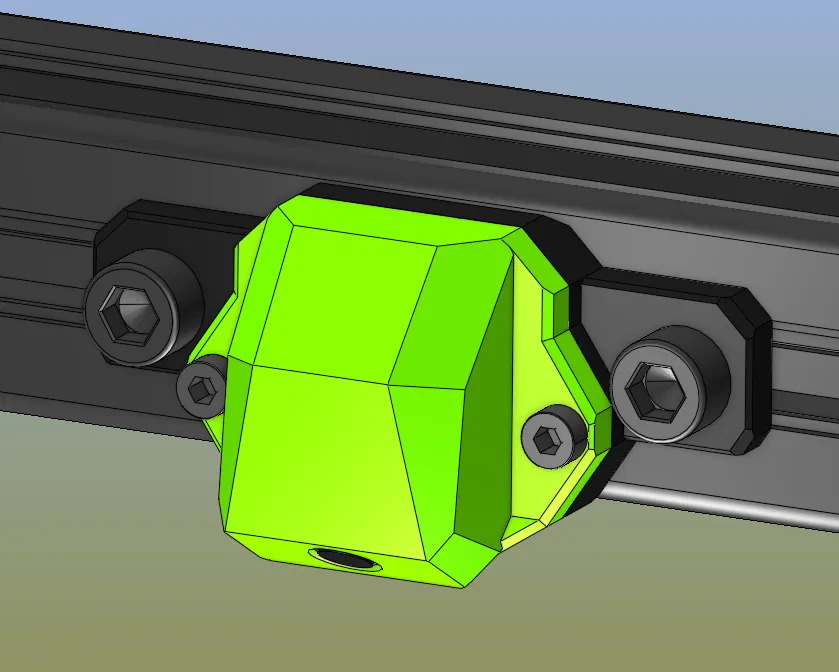

### BOM
2 pcs M3x6 (to clamp the camera to the housing)
2 pcs M3x8-10 + 2 pcs M3 heat-inserts (to mount the housing to baseplate)
2 pcs M6x12 + t-nuts (to mount to the 3030 profile)

Design by Dennis Jespersen