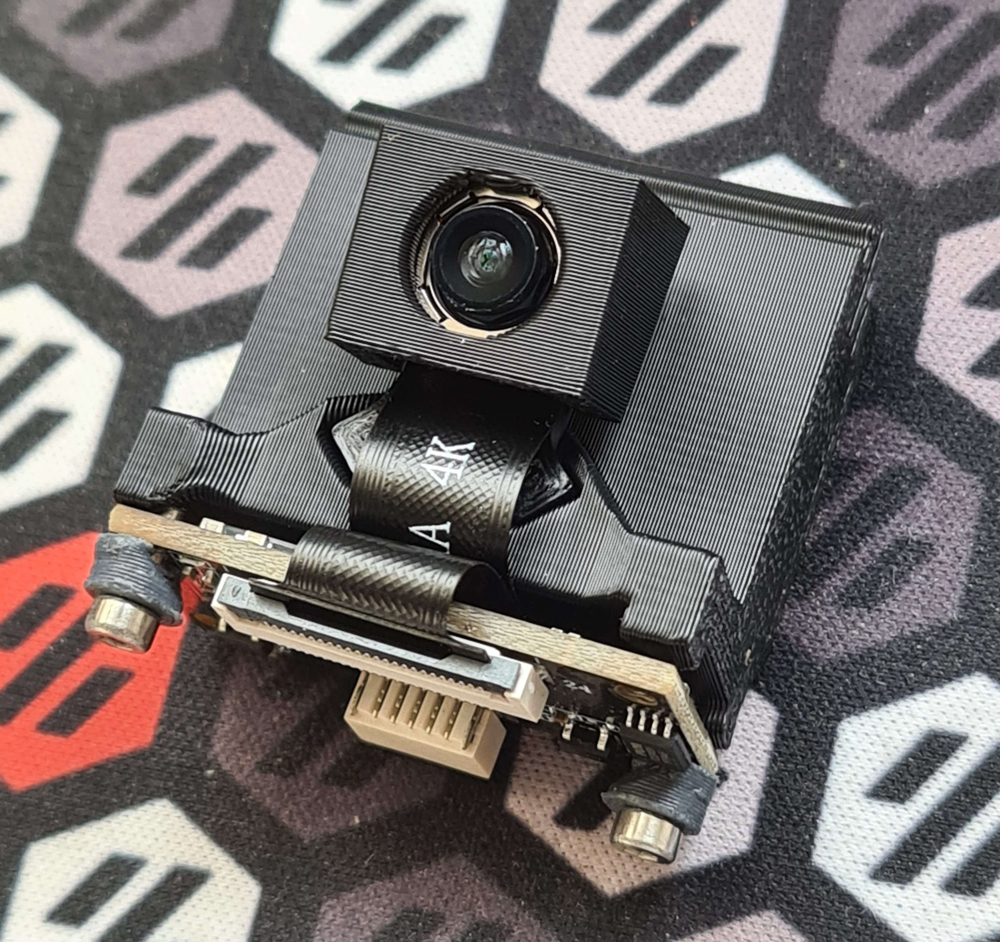

### BOM
1x M3x6-14 BHCS
1x M3 heatinsert
2x M2x10 self tapping screws

### Credits
- Zruncho for hes [ZeroPanels](https://github.com/zruncho3d/ZeroPanels "ZeroPanels") design
- Voron for their [ADXL washers](https://github.com/VoronDesign/Voron-Stealthburner/tree/main/STLs/Stealthburner/ADXL345_Mounts "ADXL washers")

Design by Olof Ogland