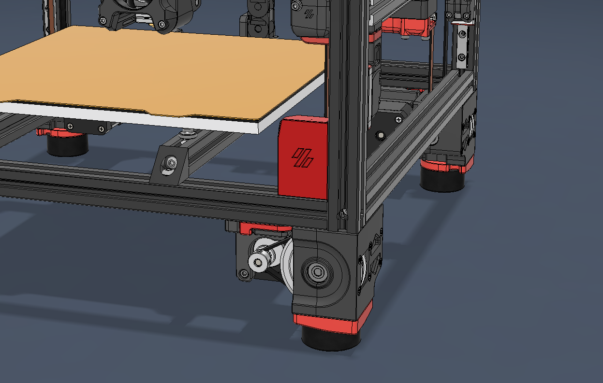
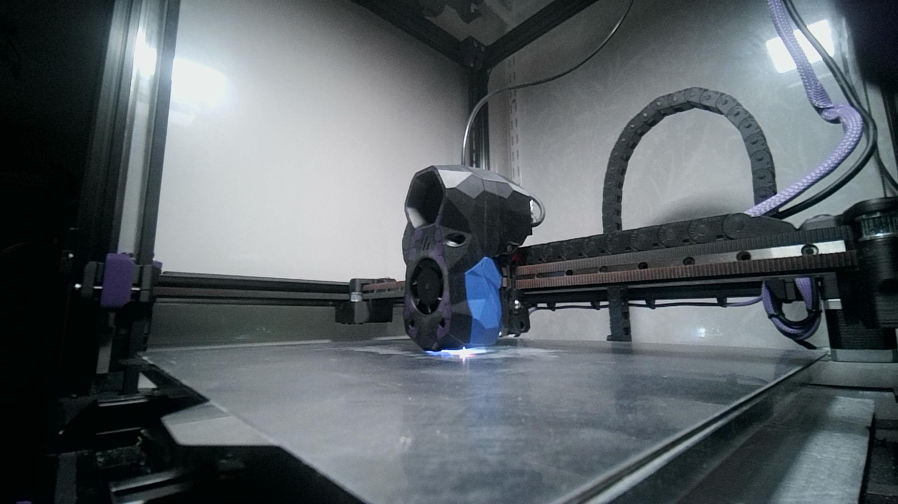

 

### BOM
4x M3x4x5 heatsets (Voron standard)

2x M3x6 FHCS

2x M3x12 FHCS

2-4x M2x10 Self tapping screws

Use the Voron [ADXL washers](https://github.com/VoronDesign/Voron-Stealthburner/tree/main/STLs/Stealthburner/ADXL345_Mounts "ADXL washers") to space out the screw heads of the M2x10 self tappers from the PCB. Otherwise there is a risk to damage the PCB.

### Credits
- Zruncho for his [ZeroPanels](https://github.com/zruncho3d/ZeroPanels "ZeroPanels") design that inspired the mounting mechanism. 
- Voron for their [ADXL washers](https://github.com/VoronDesign/Voron-Stealthburner/tree/main/STLs/Stealthburner/ADXL345_Mounts "ADXL washers")

Design by Panzarkatten